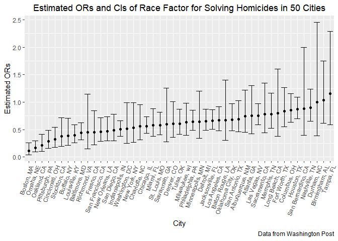

p8105\_hw6\_sy2825
================
Shuo Yan
2018-11-25

Problem 1

First, let's import and tidy the data.

    ## Parsed with column specification:
    ## cols(
    ##   uid = col_character(),
    ##   reported_date = col_integer(),
    ##   victim_last = col_character(),
    ##   victim_first = col_character(),
    ##   victim_race = col_character(),
    ##   victim_age = col_character(),
    ##   victim_sex = col_character(),
    ##   city = col_character(),
    ##   state = col_character(),
    ##   lat = col_double(),
    ##   lon = col_double(),
    ##   disposition = col_character()
    ## )

    ## Warning in evalq(as.numeric(victim_age), <environment>): NAs introduced by
    ## coercion

Now let's fit a logistic regression for Baltimore, MD.

``` r
baltimore_md_data = homicides_data %>%
  filter(city_state == "Baltimore, MD")

baltimore_md_fit = glm(solved ~ victim_age + victim_sex + victim_race, data = baltimore_md_data, family = "binomial")

broom::tidy(baltimore_md_fit, conf.int = TRUE) %>%
  filter(term == "victim_racenon-white") %>%
  mutate(odds_ratio = exp(estimate),
         conf.low = exp(conf.low),
         conf.high = exp(conf.high)) %>%
  select(8, 6, 7) %>%
  janitor::clean_names() %>%
  knitr::kable(digits = 3)
```

|  odds\_ratio|  conf\_low|  conf\_high|
|------------:|----------:|-----------:|
|        0.441|      0.312|        0.62|

Now let's run glm for each of the cities in our dataset.

``` r
glm_test = function(x) {
  
  glm_test_fit = glm(solved ~ victim_age + victim_sex + victim_race, data = x, family = "binomial")
  
 broom::tidy(glm_test_fit, conf.int = TRUE)
   
}

each_city_glm = homicides_data %>%
  group_by(city_state) %>%
  nest() %>%
  mutate(each_city_glm_test = map(data, glm_test)) %>% 
  select(-data) %>% 
  unnest() %>%
  filter(term == "victim_racenon-white") %>%
  mutate(odds_ratio = exp(estimate),
         conf.low = exp(conf.low),
         conf.high = exp(conf.high)) %>%
  select(1, 9, 7, 8) %>%
  janitor::clean_names()

each_city_glm %>% 
  mutate(city_state = fct_reorder(city_state, odds_ratio)) %>% 
  ggplot(aes(x = city_state, y = odds_ratio)) + 
  geom_point() + 
  geom_errorbar(aes(ymin = conf_low, ymax = conf_high)) + 
  labs(
    title = "Estimated ORs and CIs of Race Factor for 50 Cities",
    x = "City",
    y = "Estimated ORs",
    caption = "Data from Washington Post"
  ) +
  theme(axis.text.x = element_text(angle = 70, hjust = 1)) +
  theme(plot.title = element_text(hjust = 0.5))
```


